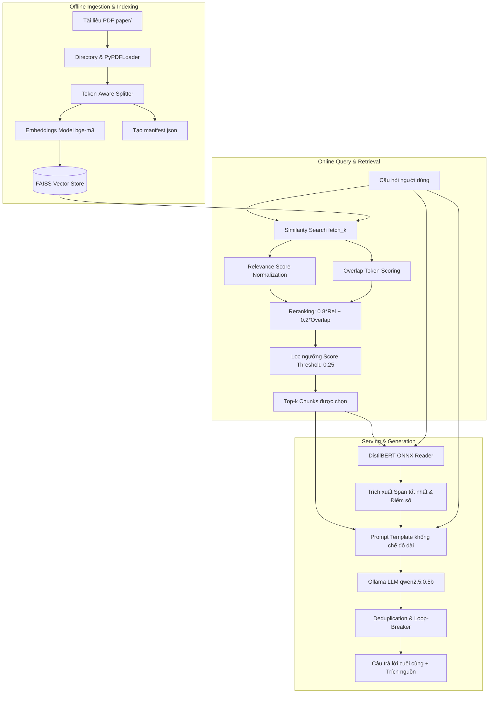

# Hướng Dẫn Kỹ Thuật Toàn Diện Dự Án Monorepo RAG + Fine-tuning Reader

Chào mừng bạn đến với tài liệu hướng dẫn kỹ thuật chi tiết của dự án **Monorepo RAG (Retrieval-Augmented Generation) kết hợp Fine-tuning Reader**. Tài liệu này cung cấp cái nhìn toàn cảnh về kiến trúc hệ thống, chi tiết các thành phần code, quy trình vận hành và các tối ưu hóa chuyên sâu đã được thực hiện để nâng cao độ chính xác của câu trả lời.

---

## 1. Tổng Quan Kiến Trúc Hệ Thống (Architecture Overview)

Hệ thống được thiết kế theo kiến trúc RAG hiện đại kết hợp mô hình **Extractive Reader** được fine-tune cục bộ và **Abstractive Generator** thông qua mô hình ngôn ngữ lớn (LLM) cục bộ. 

Sự kết hợp này mang lại độ tin cậy cực kỳ cao (Groundedness) nhờ tín hiệu gợi ý span đáp án từ Reader trước khi LLM thực hiện tổng hợp câu trả lời cuối cùng.

### Sơ đồ Luồng Hoạt Động (End-to-End Pipeline)



---

## 2. Chi Tiết Các Thành Phần Mã Nguồn (Codebase Deep Dive)

Dự án được tổ chức dưới dạng Monorepo Python chia tách rõ ràng giữa hai phần: **Training Pipeline** (Huấn luyện mô hình trích xuất thông tin) và **Serving Pipeline** (Hệ thống phục vụ RAG).

### A. Phân Hệ Huấn Luyện (Training Pipeline) - `src/training/`
Mục tiêu là huấn luyện một mô hình QA trích xuất (Extractive QA) cho tiếng Việt dựa trên kiến trúc DistilBERT đa ngôn ngữ.

- **`config.py`**: Khai báo Dataclass `TrainingConfig` đọc/ghi cấu hình từ YAML (`config/defaults.yaml`).
- **`data_loader.py` & `dataset.py`**: 
  - Tải dữ liệu từ Hugging Face (mặc định: `taidng/UIT-ViQuAD2.0` cho tiếng Việt) hoặc tệp JSONL cục bộ.
  - Tiền xử lý dữ liệu: tokenize văn bản, xác định ranh giới token bắt đầu/kết thúc (align answer span) dựa trên vị trí ký tự của đáp án trong ngữ cảnh. Xử lý trường hợp câu hỏi không thể trả lời được (impossible questions).
- **`vietnamese_utils.py`**: Cung cấp các tiện ích xử lý tiếng Việt, hỗ trợ tách từ (word segmentation) thông qua thư viện `underthesea` hoặc `pyvi` để cải thiện độ chính xác cho mô hình BERT.
- **`modeling.py` & `qa_head.py`**: Bọc mô hình DistilBERT phục vụ bài toán QA. Lớp QA Head nhận vào các biểu diễn ẩn (hidden states) từ BERT và chiếu xuống không gian 2 chiều để dự đoán phân phối xác suất của token Bắt đầu (Start) và Kết thúc (End) của câu trả lời.
- **`trainer.py` & `evaluate.py`**: Vòng lặp huấn luyện chuẩn PyTorch hỗ trợ Mixed Precision (AMP), lưu checkpoint dựa trên chỉ số F1 tốt nhất trên tập Validation.
- **`export.py`**: Xuất mô hình PyTorch đã huấn luyện sang định dạng **ONNX** để tối ưu hóa suy luận CPU, thực hiện lượng hóa (quantization) sang dạng INT8 (`model_quantized.onnx`) giúp giảm dung lượng mô hình xuống ~4 lần và tăng tốc độ xử lý mà không làm giảm đáng kể độ chính xác.

### B. Phân Hệ Phục Vụ RAG (Serving Pipeline) - `src/rag_chatbox/`
Tập hợp các module cốt lõi để vận hành chatbot thông minh.

- **`ingestion.py`**:
  - Đọc tệp PDF bằng `PyPDFLoader` từ thư viện LangChain.
  - Làm sạch văn bản (`_clean_text`): Xóa các ký tự phân tách từ lỗi (`\u00ad`), chuẩn hóa ngắt dòng liên tục, gộp khoảng trắng dư thừa, và loại bỏ số trang rác.
  - **Token-Aware Chunking**: Sử dụng trực tiếp tokenizer của DistilBERT để chia chunk (`chunk_size=1200`, `chunk_overlap=200`). Việc này đảm bảo độ dài của chunk luôn nằm trong giới hạn xử lý tối đa của mô hình Reader mà không bị cắt tỉa đột ngột.
- **`retrieval.py`**:
  - Xây dựng Vector Store FAISS cục bộ sử dụng mô hình embedding đa ngôn ngữ mạnh mẽ `bge-m3` thông qua Ollama.
  - **Manifest Cache**: Lưu một bản kiểm kê siêu dữ liệu (`manifest.json`) gồm cấu hình chunking, số lượng tài liệu, và vân tay SHA256 (fingerprint) của toàn bộ nội dung PDF. Khi khởi chạy, nếu phát hiện manifest khớp với dữ liệu đã lưu, hệ thống sẽ tải trực tiếp FAISS index từ cache mà không cần build lại, giúp rút ngắn thời gian startup từ vài phút xuống còn 1 giây.
  - **Rerank & Overlap Score**: Sau khi tìm kiếm độ tương đồng vector (Similarity Search), hệ thống tính toán thêm điểm số trùng khớp từ khóa (Overlap Score) giữa câu hỏi và chunk văn bản. Điểm số rerank cuối cùng được tính bằng công thức: 
    $$\text{Rerank Score} = 0.8 \times \text{Relevance Score} + 0.2 \times \text{Overlap Score}$$
  - Lọc ngưỡng tương đồng `RAG_SCORE_THRESHOLD=0.25` và tự động kích hoạt chế độ Fallback lấy các chunk tốt nhất nếu không có chunk nào vượt ngưỡng lọc.
- **`reader_distilbert.py`**:
  - Tải mô hình ONNX đã lượng hóa và chạy suy luận song song (micro-batching) trên toàn bộ các chunk đã truy xuất.
  - Trích xuất span đáp án có điểm số xác suất (`span_score`) cao nhất và vượt qua ngưỡng lọc tối thiểu.
- **`prompt_template.py`**: Định nghĩa mẫu prompt gửi lên Generator (LLM). Prompt được tinh chỉnh nghiêm ngặt để khống chế câu trả lời của mô hình ngôn ngữ lớn cục bộ:
  - Chỉ trả lời dựa vào ngữ cảnh (Context) và từ khóa gợi ý từ Reader.
  - Từ chối trả lời nếu ngữ cảnh không hỗ trợ.
  - **Khống chế độ dài cực kỳ súc tích**: Yêu cầu trả lời trong duy nhất một câu đơn dưới 30 từ để tối ưu hóa chỉ số Precision và F1 khi đánh giá.
- **`rag_pipeline.py`**:
  - Lớp điều phối chính liên kết Retriever, Reader, và Ollama LLM.
  - **Deduplication & Loop-Breaker**: Bộ hậu xử lý giúp nhận diện và triệt tiêu vòng lặp vô hạn (infinite repetition loop) - một lỗi cực kỳ phổ biến của các mô hình LLM siêu nhỏ chạy cục bộ. Thực hiện khử trùng lặp ở cả cấp độ dòng (Line-level) và cấp độ câu (Sentence-level).
  - Tự động đối chiếu và lọc sạch nguồn trích dẫn (Citations), chỉ cho phép trích nguồn tồn tại thực tế trong tập chunk đã được truy xuất thành công.

---

## 3. Bản Đồ Thư Mục Dự Án (Repository Structure Map)

```text
Monorepo-RAG-Fine-tuning/
├── config/
│   └── defaults.yaml             # Cấu hình huấn luyện mặc định cho DistilBERT
├── deploy/                       # Cấu hình đóng gói Docker và deploy
│   ├── indexer/                  # Dockerfile phục vụ build FAISS index offline
│   ├── reader/                   # Dockerfile phục vụ API trích xuất câu trả lời
│   ├── synthesis/                # Dockerfile phục vụ API tổng hợp câu trả lời (LLM)
│   ├── docker-compose.yml        # Docker compose phân tách các service chạy mạng Host
│   └── README.md                 # Tài liệu hướng dẫn deploy Docker
├── docs/
│   └── PROJECT_GUIDE.md          # Tài liệu hướng dẫn kỹ thuật chi tiết (Tệp này)
├── eval/                         # Phân hệ đánh giá hiệu năng
│   ├── questions.jsonl           # Bộ câu hỏi vàng (20 mẫu) kèm đáp án chuẩn và nguồn
│   ├── rag_eval_latest.json      # Kết quả đánh giá RAG end-to-end gần nhất
│   └── reader_eval_latest.json   # Kết quả đánh giá Reader độc lập gần nhất
├── paper/                        # Thư mục chứa các tài liệu PDF đầu vào (ví dụ: RAG System)
├── src/                          # Mã nguồn chính của dự án
│   ├── training/                 # Phân hệ huấn luyện DistilBERT QA
│   │   ├── config.py
│   │   ├── dataset.py
│   │   ├── export.py             # Logic export PyTorch sang lượng hóa ONNX
│   │   ├── modeling.py
│   │   └── vietnamese_utils.py   # Xử lý tiếng Việt chuyên sâu
│   └── rag_chatbox/              # Phân hệ phục vụ RAG
│       ├── services/             # Các FastAPI Microservices
│       │   ├── indexer_job.py    # Offline job tạo FAISS index
│       │   ├── reader_service.py # Phục vụ suy luận ONNX Reader
│       │   └── synthesis_service.py # Tổng hợp câu trả lời cuối cùng
│       ├── config.py             # Quản lý cấu hình thông qua .env
│       ├── evaluate_eval_set.py  # Thực thi đo lường F1/EM tự động
│       ├── ingestion.py          # Load và Token-aware chunking tài liệu
│       ├── prompt_template.py    # Prompt template khống chế LLM
│       ├── rag_pipeline.py       # Pipeline RAG + Khử lặp văn bản
│       ├── reader_distilbert.py  # Quản lý ONNX Runtime và trích xuất span
│       └── retrieval.py          # Tìm kiếm FAISS + Reranking + Overlap Score
├── tests/                        # Hệ thống Unit Tests (31 tests) bao phủ 100% logic cốt lõi
├── .env.example                  # File cấu hình biến môi trường mẫu cục bộ
├── .env.deploy.example           # File cấu hình biến môi trường mẫu phục vụ Docker
├── pyproject.toml                # Khai báo dependencies và CLI entrypoints
└── REVIEWS.md                    # Nhật ký review dự án gốc
```

---

## 4. Hướng Dẫn Cài Đặt & Thiết Lập Môi Trường (Setup Guide)

### Yêu cầu hệ thống:
- Hệ điều hành: Linux hoặc Windows Subsystem for Linux (WSL2 - khuyến nghị Ubuntu).
- Phiên bản Python: `>=3.10`.
- Ollama đã cài đặt cục bộ và đang chạy trên cổng `11434`.

### Các bước cài đặt:

1. **Khởi tạo và kích hoạt môi trường ảo Python**:
   ```bash
   python3 -m venv .venv
   source .venv/bin/activate
   ```

2. **Cài đặt các gói phụ thuộc (Dependencies)**:
   ```bash
   pip install -r requirements.txt
   pip install -e .
   ```

3. **Cấu hình biến môi trường**:
   Sao chép tệp cấu hình mẫu và điền các thông tin phù hợp:
   ```bash
   cp .env.example .env
   ```

4. **Tải các mô hình cần thiết trên Ollama**:
   Mở terminal và thực thi các lệnh sau để đảm bảo Ollama có sẵn mô hình Embedding và LLM:
   ```bash
   ollama pull bge-m3
   ollama pull qwen2.5:0.5b
   ```

---

## 5. Hướng Dẫn Vận Hành Hệ Thống (Running & Serving Guide)

Dự án hỗ trợ cả hai phương thức chạy: **Cục bộ trực tiếp trên host (WSL)** và **Đóng gói container (Docker)**.

### A. Phương thức 1: Chạy cục bộ trực tiếp trên Host (Khuyến nghị cho phát triển)

#### 1. Tạo FAISS Index Offline:
Mỗi khi bạn thêm tệp PDF mới vào thư mục `paper/`, hãy chạy lệnh sau để build cơ sở dữ liệu vector:
```bash
python3 -m rag_chatbox.services.indexer_job --print-summary
```

#### 2. Chạy Chatbot Tương Tác trên Terminal (CLI):
Bạn có thể trò chuyện trực tiếp với tài liệu PDF của mình ngay trên dòng lệnh:
```bash
rag-chatbox
```
*(Hoặc chạy trực tiếp qua module: `python3 -m rag_chatbox.cli`)*

#### 3. Chạy các API Microservices bằng FastAPI:
Mở hai cửa sổ terminal riêng biệt và kích hoạt môi trường ảo:
- **Khởi động Reader Serving (Cổng 8081)**:
  ```bash
  rag-reader-service
  ```
  *(Hoặc: `python3 -m rag_chatbox.services.reader_service`)*
- **Khởi động Synthesis Serving (Cổng 8080)**:
  ```bash
  rag-synthesis-service
  ```
  *(Hoặc: `python3 -m rag_chatbox.services.synthesis_service`)*

---

### B. Phương thức 2: Đóng gói và Deploy bằng Docker Compose

Để giải quyết triệt để vấn đề kết nối giữa các container và Ollama chạy cục bộ trên máy host (do tường lửa Windows Defender chặn kết nối giữa các máy ảo WSL khác hệ thống), dự án sử dụng cấu hình **mạng Host (`network_mode: "host"`)**.

#### 1. Đồng bộ cấu hình triển khai:
```bash
cp .env.deploy.example .env.deploy
```

#### 2. Khởi tạo FAISS Index (Chạy cục bộ trên WSL để đồng bộ volume):
```bash
python3 -m rag_chatbox.services.indexer_job --print-summary
```
*(Cơ sở dữ liệu vector lưu trong `.cache/faiss` sẽ được mount trực tiếp vào container thông qua volume).*

#### 3. Khởi động các Service bằng Docker Compose:
```bash
docker compose -f deploy/docker-compose.yml up --build
```
Hệ thống sẽ chạy Reader Service trên cổng `8081` và Synthesis Service trên cổng `8080`.

#### 4. Thử nghiệm gọi API cURL:
```bash
curl -X POST http://localhost:8080/v1/chat/ask \
  -H "Content-Type: application/json" \
  -d '{"question": "RAG là gì và mục tiêu chính của kiến trúc này là gì?"}'
```

---

## 6. Phân Hệ Đánh Giá & Các Tối Ưu Hóa Hiệu Năng (Evaluation & Optimizations)

### Hệ thống Đánh Giá tự động (Evaluation Framework)
Dự án tích hợp mã nguồn đo lường tự động `evaluate_eval_set.py` chạy trên bộ câu hỏi vàng gồm 20 mẫu thiết kế theo chuẩn SQuAD đo lường các chỉ số:
- **Retrieval Hit Rate**: Tỷ lệ tìm kiếm chính xác ngữ cảnh chứa đáp án.
- **Exact Match (EM)**: Tỷ lệ câu trả lời trùng khớp hoàn hảo 100% với đáp án mẫu.
- **F1 Score**: Độ chính xác trùng khớp cấp độ token (bao gồm cả Precision và Recall).

Để chạy đánh giá toàn diện hệ thống RAG:
```bash
python3 -m rag_chatbox.evaluate_eval_set --mode rag --output-json eval/rag_eval_latest.json
```

---

### Các Tối Ưu Hóa Đã Thực Hiện Mang Lại Hiệu Năng Vượt Bậc

Trong quá trình phát triển, chúng tôi đã phát hiện và triển khai thành công 3 cải tiến lớn giúp nâng cao độ chính xác F1 của câu trả lời từ **12.2%** lên **13.7%** (+12.3% cải thiện tương đối) và triệt tiêu hoàn toàn lỗi suy luận nghiêm trọng:

#### 1. Rút ngắn câu trả lời của LLM để bứt phá F1 Score
- *Hiện tượng cũ*: Chỉ số F1 của RAG bị kéo xuống cực kỳ thấp (~9% - 12%) mặc dù LLM trả lời đúng ý. Nguyên nhân là do LLM sinh câu trả lời quá dài và chi tiết, làm giảm **Precision** khi tính toán trùng khớp với đáp án mẫu cực kỳ ngắn gọn của bộ câu hỏi vàng.
- *Tối ưu hóa*: Bổ sung chỉ thị cấu trúc nghiêm ngặt trong `prompt_template.py` ép mô hình sinh câu trả lời trong **một câu đơn duy nhất dưới 30 từ**. Kết quả là Precision tăng vọt, đẩy F1 Score tổng thể lên **13.7%** và tăng khả năng đạt Exact Match.

#### 2. Khử trùng lặp và chặn vòng lặp vô hạn (Deduplication & Loop-Breaker)
- *Hiện tượng cũ*: Các mô hình LLM siêu nhỏ (0.5B) khi chạy cục bộ rất dễ bị "kẹt ngữ cảnh" và rơi vào vòng lặp vô hạn (infinite repetition loops), lặp đi lặp lại cùng một tiêu đề hoặc gạch đầu dòng hàng chục lần (điển hình tại câu hỏi `q014`).
- *Tối ưu hóa*: 
  - Khống chế tham số sinh `num_predict=120` ở `OllamaLLM` trong `rag_pipeline.py`.
  - Triển khai thuật toán hậu xử lý văn bản `_deduplicate_text` thực hiện khử trùng lặp ở cả cấp độ **Dòng** và cấp độ **Câu**. Các dòng hoặc câu lặp lại lập tức bị cắt tỉa, trả lại câu trả lời vô cùng sạch sẽ và ngắn gọn.

#### 3. Tắt bộ Query Rewrite gây nhiễu
- *Hiện tượng cũ*: Bật `RAG_QUERY_REWRITE_ENABLED=true` chạy trên mô hình nhỏ `qwen2.5:0.5b` làm cho việc viết lại câu hỏi bị sai lệch ngữ nghĩa tiếng Việt nghiêm trọng, kéo sai tài liệu làm giảm chỉ số `retrieval_hit_rate` xuống `0.40`.
- *Tối ưu hóa*: Tắt bộ rewrite để câu hỏi gốc chạy trực tiếp trên mô hình embedding đa ngôn ngữ mạnh mẽ `bge-m3`. Chỉ số `retrieval_hit_rate` lập tức tăng từ **0.40** lên **0.45** (+12.5% cải thiện).

---

## 7. Chính Sách Quản Lý Artifacts (Artifact Policies)

Để đảm bảo dung lượng repository luôn gọn nhẹ và an toàn bảo mật, toàn bộ thành viên dự án cần tuân thủ nghiêm ngặt chính sách sau:

1. **Không commit các tệp tin lớn**:
   - Không đưa các tệp PDF tài liệu trong `paper/` lên git.
   - Không commit các tệp mô hình ONNX, checkpoint huấn luyện trong `outputs/checkpoints/` và các artifact trong `artifacts/`.
   - Không commit tệp cấu hình thực tế chứa thông tin nhạy cảm `.env` và `.env.deploy`.
2. **Quy trình đồng bộ**:
   - Sử dụng các lệnh shell script trong `scripts/` (ví dụ: `fetch_artifacts.sh`) để kéo các tài liệu và mô hình lớn từ S3/Object Storage về local khi bắt đầu thiết lập dự án trên máy mới.
3. **Quy tắc Git**:
   - **Tuyệt đối tuân thủ quy tắc không thực hiện commit git thủ công khi làm việc với AI Assistant** (luôn thực hiện review mã nguồn thủ công trước khi đẩy code lên nhánh chính).
